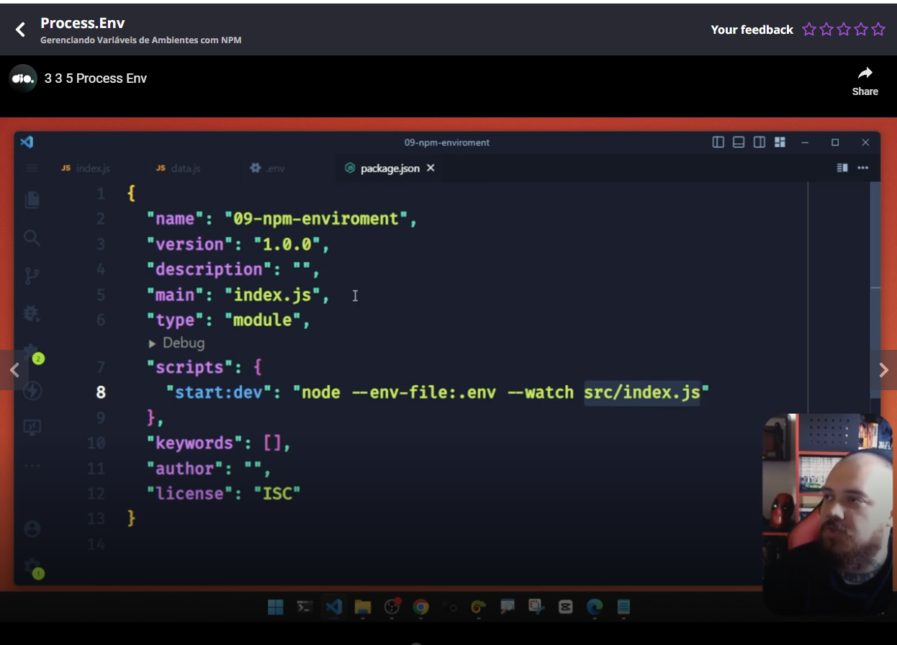
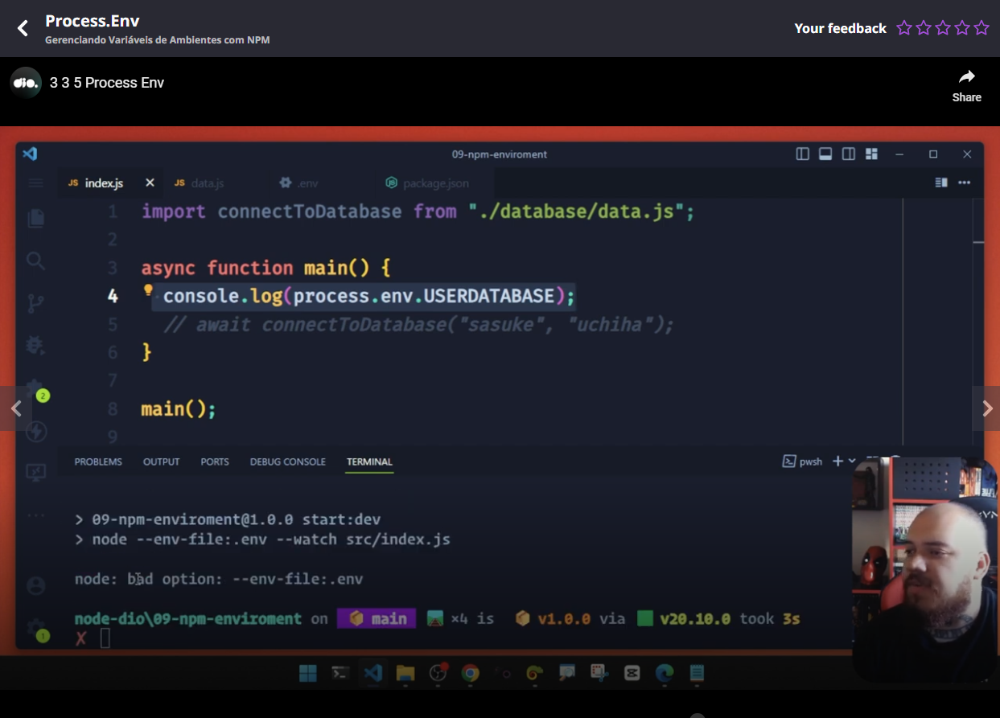
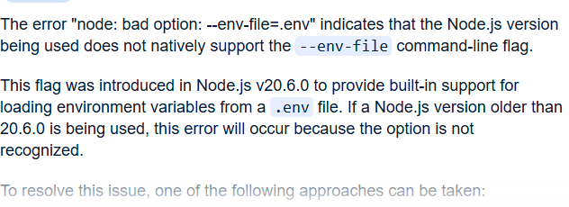

# Introduction

This is the way you specify the env file in package.json



And this is the way to use an environment variable:



An error related to Node.JS version and versions prior to 20.6.0:



To install NVM, **N**ode **V**ersion **M**anager  please do the following command (in Linux):

```
curl -o- https://raw.githubusercontent.com/nvm-sh/nvm/v0.37.2/install.sh | bash
```

And then you can type **in a new terminal** the following commands to install Node.JS 21 (20.6.0+ example) and use it:

```
nvm install 21
nvm use 21
```
